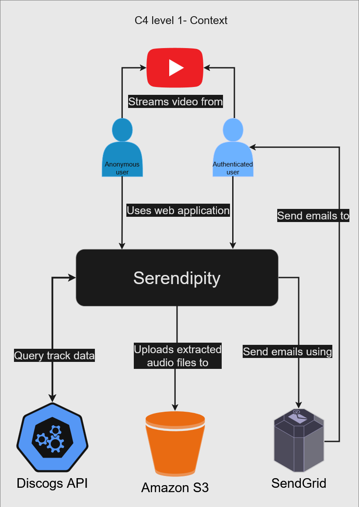

# Serendipity - Architecture Documentation

**Version:** 1.0
**Date:** 2025-12-20
**Author:** Frederico Mozzato
**Status:** Draft for Review

---

## Table of Contents

1. Introduction and Goals
2. Constraints
3. System Context
4. Solution Strategy
5. Building Block View (Containers & Components)
6. Runtime View (Key Scenarios)
7. Deployment View
8. Cross-Cutting Concepts
9. Architecture Decisions
10. Quality Requirements
11. Risks and Technical Debt
12. Glossary

---

## 1. Introduction and Goals

### 1.1 Requirements Overview

**What is Serendipity?**
>[!quote]
>The ability to find valuable or agreeable things not sought for.
>
>[Merriam-Webster](https://www.merriam-webster.com/dictionary/serendipity)

Serendipity is a random music discovery app built without any recommendation
algorithm. The song selection is purely random and the users may expect
anything to pop up. It is an app for people that like discovering new artists
and songs and that enjoy listening to different and unexpected things.

The target user wants to explore songs out of the normal spectrum and is not
interested in the valuable but predictable recommendations used by regular
music streaming apps, that use listening patterns to find relevant songs. Our
users like to be surprised.

Serendipity allows any user to browse a player that generates a new random
song. The player will allow the users to filter based on genre, year and
country of origin, but that's about it. Everything else is random and subjected
to chance.

Users can access their listening history, like songs to add them to their
collection and create playlists to group songs together. The user will also be
able to download songs directly to their computers for sampling purposes.

The playlists can be shared through links so other users can hear
mixes/collections, adding a social aspect to the application.

---

## 2. Constraints

### 2.1 Technical Constraints


**Language**
Serendipity will be implemented in Golang since this is a great language to handle web services and allows the app to be fast with its asynchronous capabilities. This is also a study project to help me, as a developer, learn the language and build portfolio in it.

**Architecture**
The application will be divided in three main services:

1. The web server
2. The download service
3. The notification service

This choice is done to help separate the concerns, increase isolation and help me learn the micro service paradigm with a real project.

The app will be backed by the [Discogs
API](https://www.discogs.com/developers). The music data will be all fetched
from this open and free database with millions of artists and songs. So we'll
be limited to their catalogue.

One important consideration to make is that we'll be doing Server Side Rendering in the web server so we can focus as much as possible in building the backend (which is the maind focus on this project) while not having to maintain a second Javascript application.

The same constraint (the focus on backend) will mean that the front end design
and implementation will have massive help from AI tools, adding another layer
for learning on prototyping and using AI coding agents to get things done. The
initial idea is to use [Lovable](https://lovable.dev/) and [Claude Code](https://claude.com/product/claude-code) for this task.


### 2.2 Organizational Constraints
**Timeline**
This application doesn't have a hard delivery date, but the initial estimative
is to be able to ship its core functionalities (song recommendation, history
and playlist creation) in 2026 first quarter.

The download and email features will be implemented after the core is ready and
running.

**Team**
This is a solo project. I'll be the only developer and I'll be using AI tools
to help me with the parts that are not the learning focus (frontend).

I'll be tasked on building the backend and project's infrastructure.

**Budget**
Since this is a passion project aimed for learning I expect to not spend too
much money on it initially. I'll need to manage cloud and domain costs that I
intend on keeping below U$ 20.00 per month.

**Deployment**
The application will run on AWS.

## 3. System Context

### 3.1 Business Context

**Context diagram**


**[Paste C4 Level 1 diagram here once you draw it]**

Serendipity will allow both anonymous and authenticated users to access the
service. No one will *need* to make an account to use the application but the
scope will be different for each type of user.

**Anonymous users**
Can access the application through the web. Will be able to use the player, filter results and play tracks.

**Authenticated users**
Will access the app the same way as anonymous users and have all the same capabilites plus being able to view and manage their listening history, liking songs to add them to their collection, creating and sharing mixes and downloading songs.

#### External Entities:
**Discogs API**
As mentioned, the main dependency is the Discogs API. This is the music
catalogue that Serendipity will drink from, fetching release data from it and
displaying it in the player.

The Discogs API returns results that have embedded Youtube video links. We'll
use these links to render the Youtube player so the users can listen to the
songs.

**AWS**
The application will run on AWS and we'll use S3 to store the downloaded files to serve back to users. The files will be periodically cleaned up using S3 lifecycle policies.

### 3.2 Technical Context

**Communication Channels:**

[For each connection in your context diagram, describe the protocol]

| Channel | Technology | Purpose |
|---------|-----------|---------|
| User ↔ Main Server | [Protocol?] | [Why?] |
| Main Server ↔ PostgreSQL | [Protocol?] | [Why?] |
| ... | ... | ... |

---

## 4. Solution Strategy

### 4.1 Technology Decisions

[For each major technology choice, write a paragraph explaining WHY]

**Go:**
[Why Go for all services? What does it give you?]

**Microservices architecture:**
[Why 3 services instead of monolith? What are the benefits for YOUR specific case?]

**PostgreSQL:**
[Why Postgres over MySQL? What features do you need?]

**RabbitMQ:**
[Why RabbitMQ over NATS or other queues? What guarantees do you need?]

**Server-Side Rendering:**
[Why SSR instead of React/SPA? What's the trade-off?]

### 4.2 Architecture Patterns

[What patterns are you using? Explain each in 2-3 sentences]

**Event-Driven Architecture:**
[How do services communicate? Why async?]

**Event-Carried State Transfer:**
[What data is in events? Why not query databases?]

**Worker Pool Pattern:**
[How does download service work? Why fixed pool?]

**Repository Pattern:**
[How do you abstract database access? Why?]

---

## 5. Building Block View

### 5.1 Level 1: System Overview (Container Level)

**[Paste C4 Level 2 Container diagram here once you draw it]**

**Containers:**

[List every deployable unit in your system]

| Container | Responsibility | Technology |
|-----------|---------------|------------|
| Main Web Server | [What does it do?] | [Tech stack] |
| PostgreSQL | [What's stored?] | [Version] |
| RabbitMQ | [What queues exist?] | [Version] |
| ... | ... | ... |

### 5.2 Level 2: Main Web Server (Component Level)

**[Paste Main Server component diagram here once you draw it]**

**Purpose:** [1-2 sentence description]

**Components:**

[List internal packages/components]

| Component | Responsibility | Technology/Pattern |
|-----------|---------------|-------------------|
| HTTP Handlers | [What does it do?] | [What packages?] |
| Auth | [What does it do?] | [OAuth flow?] |
| Discovery Engine | [What does it do?] | [Algorithm?] |
| ... | ... | ... |

**Key Interfaces:**

[Show 2-3 critical interfaces as code blocks]
```go
// Example:
type DiscoveryEngine interface {
    // Methods...
}
```

**Package Structure:**
```
main.go
├── handlers/
│   ├── [list files]
├── auth/
│   ├── [list files]
...
```

**Dependencies:**
- [List what external systems this container talks to]

### 5.3 Level 2: Download Service (Component Level)

**[Paste Download Service component diagram here once you draw it]**

**Purpose:** [1-2 sentence description]

**Components:**

[Same structure as Main Server - list components, interfaces, package structure]

**Worker Flow:**

[Describe the step-by-step process]
1. [First step]
2. [Second step]
3. ...

**Configuration:**

[What's configurable?]
- Worker pool size: [How many? Why?]
- Temp directory: [Where? Why?]
- S3 bucket: [Name? Policy?]
- Max file size: [Limit? Why?]

### 5.4 Level 2: Notification Service (Component Level)

**[Paste Notification Service component diagram here once you draw it]**

**Purpose:** [1-2 sentence description]

**Components:**

[Same structure - keep it short since it's simple]

**Event Structure:**
```go
// Show the event struct you defined earlier
type DownloadCompleted struct {
    // Fields...
}
```

**Design Rationale:**

[Explain why this service is intentionally simple. Why no database access?]

---

## 6. Runtime View (Key Scenarios)

### 6.1 Scenario: User Discovers Random Song

[Write the step-by-step flow]
```
1. User visits homepage
2. Main Server [does what?]
3. [Continue the flow...]
```

**Sequence:**

[Optional: Draw a sequence diagram or describe interactions]
```
User → Main Server: GET /
Main Server → PostgreSQL: [Query?]
PostgreSQL → Main Server: [Response?]
Main Server → User: [Render HTML with ?]
```

### 6.2 Scenario: User Requests Download

[Write the complete flow from click to email]
```
1. User clicks "Download" button
2. Main Server [validates? creates job?]
3. Main Server → RabbitMQ: [Publishes what?]
4. [Continue through all services...]
```

### 6.3 Scenario: Download Fails

[What happens when yt-dlp fails? How is user notified?]

---

## 7. Deployment View

### 7.1 Infrastructure Overview

[Where will each container run?]

**[Draw a deployment diagram showing servers/containers]**

**Deployment Units:**

| Unit | Environment | Resources |
|------|-------------|-----------|
| Main Web Server | [AWS EC2? Docker?] | [CPU/RAM?] |
| Download Service | [Same machine? Separate?] | [CPU/RAM?] |
| ... | ... | ... |

### 7.2 Deployment Strategy

[How do you deploy?]
- CI/CD pipeline: [GitHub Actions? What triggers deploy?]
- Database migrations: [How? When?]
- Zero-downtime: [Strategy?]
- Rollback: [How?]

### 7.3 Monitoring and Operations

[How will you know if something breaks?]
- Logging: [What tool? What gets logged?]
- Metrics: [What do you track?]
- Alerts: [What triggers alerts?]
- Health checks: [What endpoints?]

---

## 8. Cross-Cutting Concepts

### 8.1 Security

**Authentication:**
[How do users log in? What's the flow?]

**Authorization:**
[How do you check permissions?]

**Data Protection:**
[HTTPS? Encryption? Session management?]

### 8.2 Error Handling

[How do services handle errors?]

**Main Server:**
- [User errors? Show error page?]
- [System errors? Log and show generic message?]

**Download Service:**
- [Retry logic? How many times?]
- [When to give up? How to notify user?]

**Notification Service:**
- [Email fails? Retry? Give up?]

### 8.3 Logging

[What gets logged? What format?]

**Log Levels:**
- Info: [What events?]
- Warning: [What situations?]
- Error: [What failures?]

**Structured Logging:**
[Using slog? What fields are always included?]

### 8.4 Testing Strategy

[How will you test each layer?]

**Unit Tests:**
[What gets unit tested? Mock strategy?]

**Integration Tests:**
[What gets integration tested? Real DB?]

**End-to-End Tests:**
[Full flow tests? How?]

---

## 9. Architecture Decisions

[Use ADR (Architecture Decision Record) format]

### ADR-001: Use RabbitMQ over NATS

**Status:** Accepted

**Context:**
[What's the problem? What options did you consider?]

**Decision:**
[What did you choose?]

**Consequences:**
[What are the trade-offs? Pros/cons?]

---

### ADR-002: Propagate Email Through Events

**Status:** Accepted

**Context:**
[Should notification service query database or get email from event?]

**Decision:**
[What did you choose and why?]

**Consequences:**
[What does this enable? What does it cost?]

---

### ADR-003: [Add more decisions]

[For each major decision: shared database, SSR vs SPA, PostgreSQL vs MySQL, etc.]

---

## 10. Quality Requirements

### 10.1 Performance

| Metric | Target | Measurement |
|--------|--------|-------------|
| Page load time | [< 2s?] | [How measured?] |
| API response time | [< 500ms?] | [How measured?] |
| Download processing | [< 60s?] | [How measured?] |

### 10.2 Scalability

[How many users can system handle?]
- Concurrent users: [Target?]
- Downloads per hour: [Target?]
- Scaling strategy: [Horizontal? Vertical?]

### 10.3 Availability

[Uptime requirements?]
- Target: [99%? 99.9%?]
- Acceptable downtime: [How much?]
- Recovery time: [How fast?]

---

## 11. Risks and Technical Debt

### 11.1 Known Risks

[What could go wrong?]

| Risk | Probability | Impact | Mitigation |
|------|-------------|--------|------------|
| [e.g., YouTube blocks yt-dlp] | [High/Med/Low] | [High/Med/Low] | [What's plan B?] |
| [Shared database becomes bottleneck] | ... | ... | ... |

### 11.2 Technical Debt

[What shortcuts are you taking? Why? When will you fix?]

- [e.g., "Main Server and Download Service share database - acceptable for MVP, split when X users"]
- [e.g., "No rate limiting on API - add when traffic increases"]

---

## 12. Glossary

[Define any terms that might be unclear]

| Term | Definition |
|------|------------|
| Event-Carried State Transfer | [Your definition] |
| Worker Pool | [Your definition] |
| Presigned URL | [Your definition] |
| ... | ... |

---

## Appendix: Diagrams

[Include all C4 diagrams here if not inline above]

### A.1 System Context (C4 Level 1)
[Diagram]

### A.2 Container View (C4 Level 2)
[Diagram]

### A.3 Component View - Main Server (C4 Level 3)
[Diagram]

### A.4 Component View - Download Service (C4 Level 3)
[Diagram]

### A.5 Component View - Notification Service (C4 Level 3)
[Diagram]
